# Collavo Use Case Diagrams

This document captures essential flows for Collavo based on the current Next.js App Router implementation, API contracts (`app/api/projects`, `app/api/projects/[id]`, `app/api/uploadthing`), and Drizzle schema (`db/schema.ts`). Each section combines a brief description with PlantUML code ready for rendering.

## Authentication & Accounts

Handles onboarding, login, credential recovery, and invitation acceptance through Better Auth and email services.

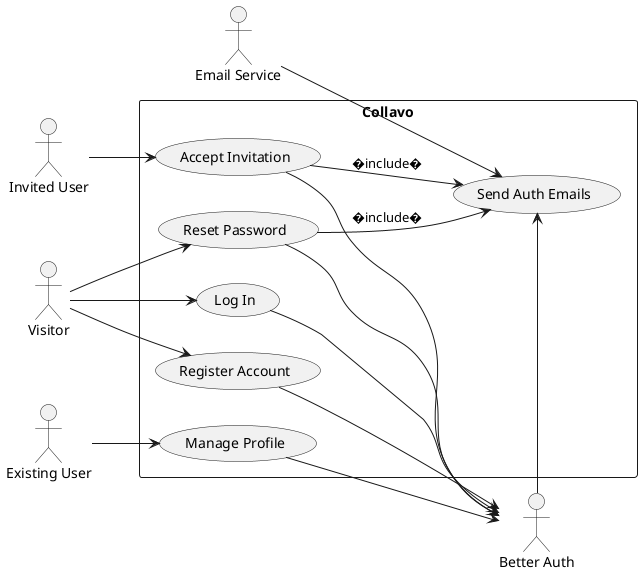

## Project Governance

Summarizes how leaders shape project workspaces, manage access, and schedule reminders.

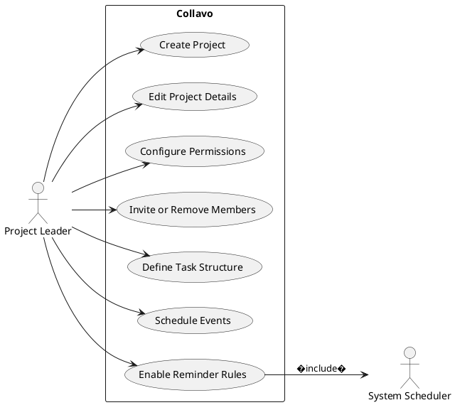

## Collaboration & Execution

Shows day-to-day teaming interactions for members and read-only viewers.

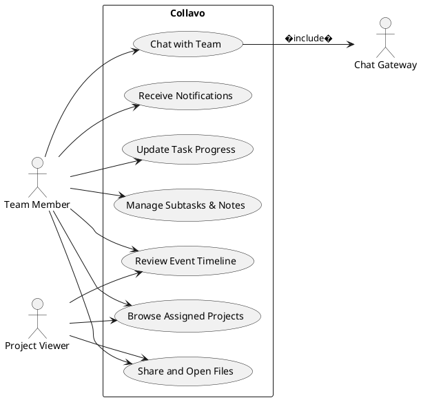

## Support Services & Integrations

Highlights background systems that underpin Collavo features.

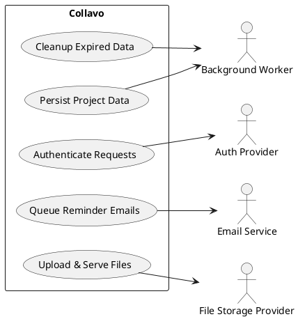

## Project Creation Flow

Expands the creation path from form submission to seeded permissions in `app/api/projects/route.ts`.

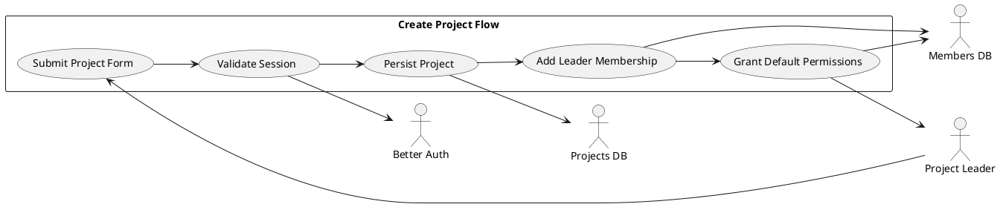

## Task Creation Flow

Captures `POST /api/projects/{id}/tasks` logic for forming main tasks with nested subtasks.

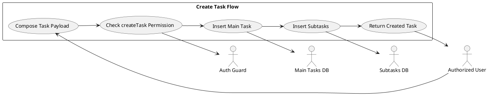

### Sequence Diagram (Mermaid)

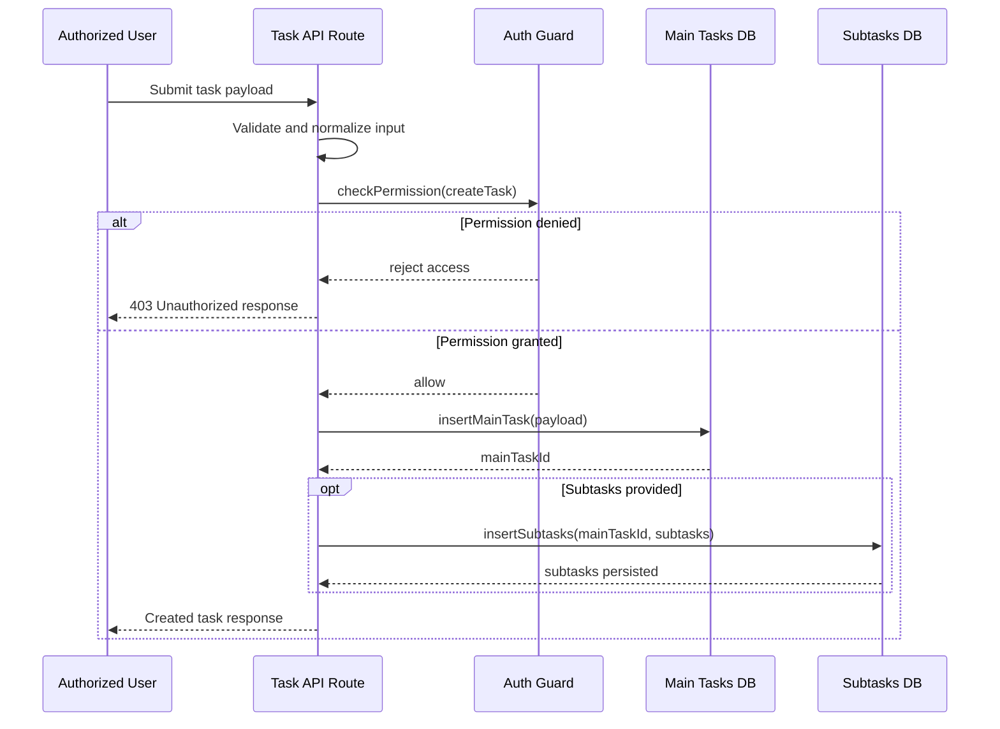

## Event Creation Flow

Details how leaders define milestones and optional reminder schedules.

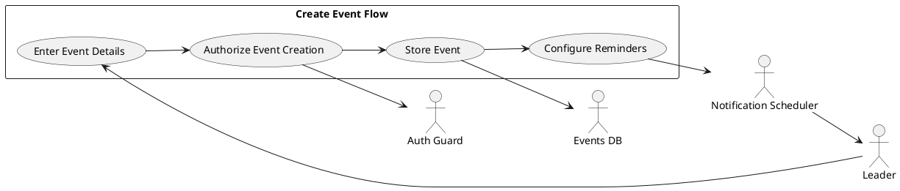

## File Upload Flow

Maps the file upload path via Uploadthing middleware and metadata persistence.

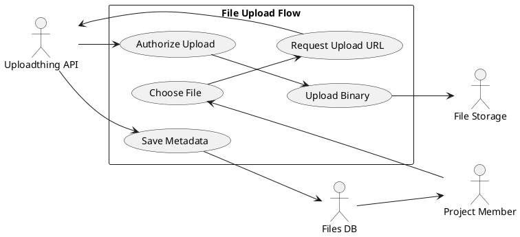

## Permission Management Flow

Illustrates how leaders adjust member capabilities for a project.

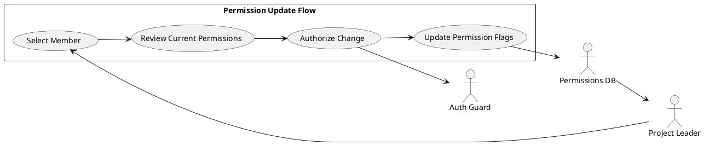

## Member Invitation Flow

Shows the process of inviting peers and provisioning access.

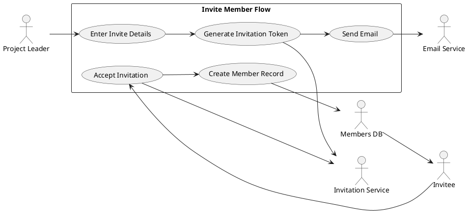

