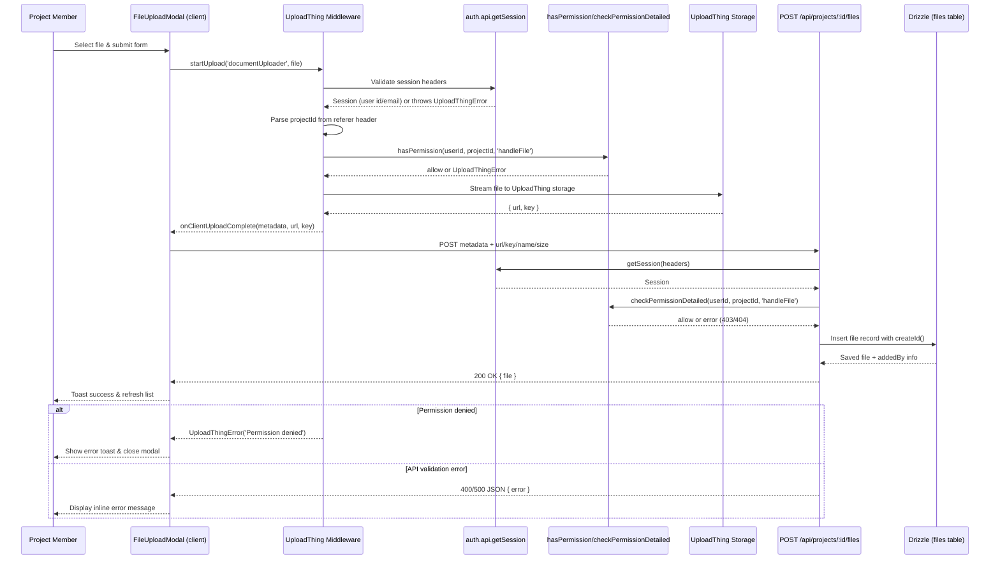

# File Upload Flow

This diagram reflects the current end-to-end upload experience implemented in `components/project/FilesView/FileUploadModal.tsx`, `app/api/uploadthing/core.ts`, and the routes under `app/api/projects/[id]/files`. It highlights the authentication and permission checks that gate uploads before a record is persisted.

